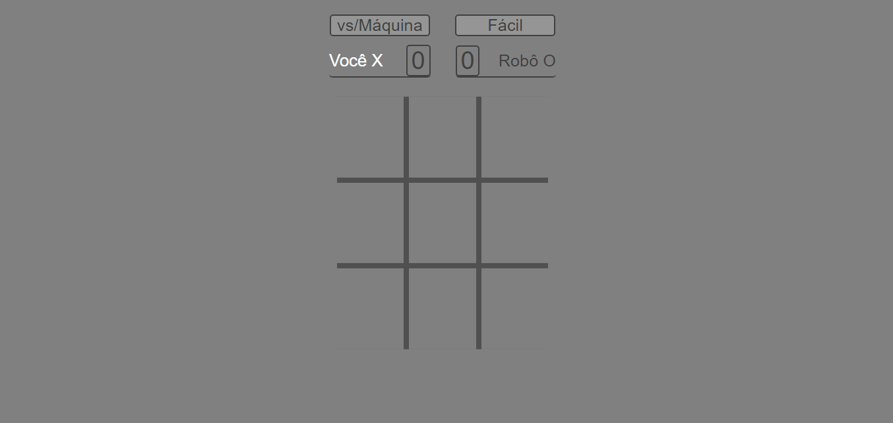
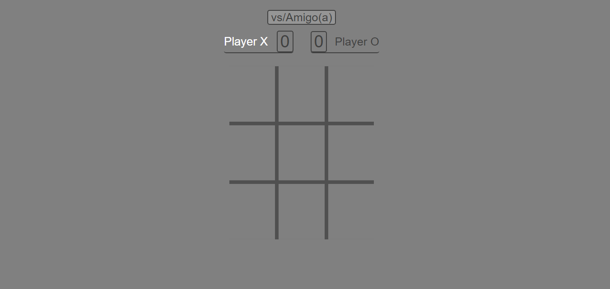
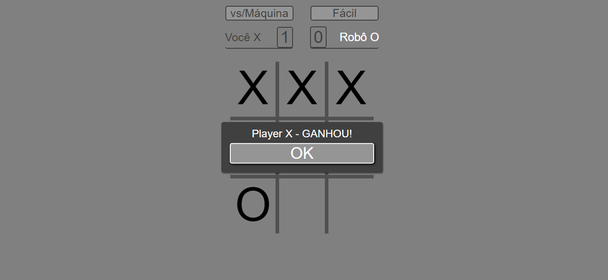

<h1> #️⃣ Jogo-da-velha </h1>
<h3 align="center"> Projeto simples, nível iniciante, para fins de prática de conteúdo. </h3>

----

<h2> 💻 Tecnologias utilizadas: </h2>

  

----

<h2> 🧍 Para todos:</h2>

Jogo da velha tal como conhecido, basicamente um tabuleiro, para dois adversários.

Sendo "X" contra "O". Que consiste em se apropriar de um dos 09 (nove) espaços/casas de cada vez alternando os jogadores

Ganha quem preencher a sequência de 03 (três) espaços/casas primeiro, seja na horizontal, vertical ou diagonal.

Caso não seja possível e não restem jogadas, resulta no empate.

----

<h2>🖼️ Imagens: </h2>

<h3> Modo vs/Máquina </h3>

Jogar contra o robô programado como adversário.
  
<h3> Modo vs/Amigo(a)</h3>

Possibilidade de jogarem duas pessoas.
  
<h3>Resultado da partida</h3>

Caixa de alerta exibe a vitória ou o empate.

----
 
<h2> 🚀 Para Dev's:</h2>

<h3> Conhecimentos utilizados... </h3>

- HTML5
  - Elementos
  - Atributos
  - Semântica
  - Caminho de arquivos
- CSS3
  - Seletores
  - CSS Flexbox
  - Combinadores
  - Posições
  - Transformações
  - Responsividade
- Javascript
  - DOM
  - Variáveis
  - Strings
  - Arrays
  - Funções
  - Declarações condicionais

<h3> 🔮 Futures </h3>

- Mudar layout
- Implementar modos de jogo
  - Moderado
  - Impossível
  - Corrigir erros

----

<h2 align="center"> <a href = "https://raimonesbarros.github.io/Jogo-da-velha/" target="_blank"> 🎮 Ir para Jogo </a></h2>

----

----

<h3>🦟 Reportar Erro </h3>
 

----